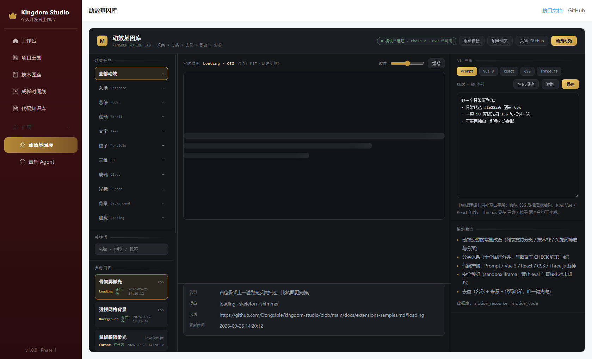
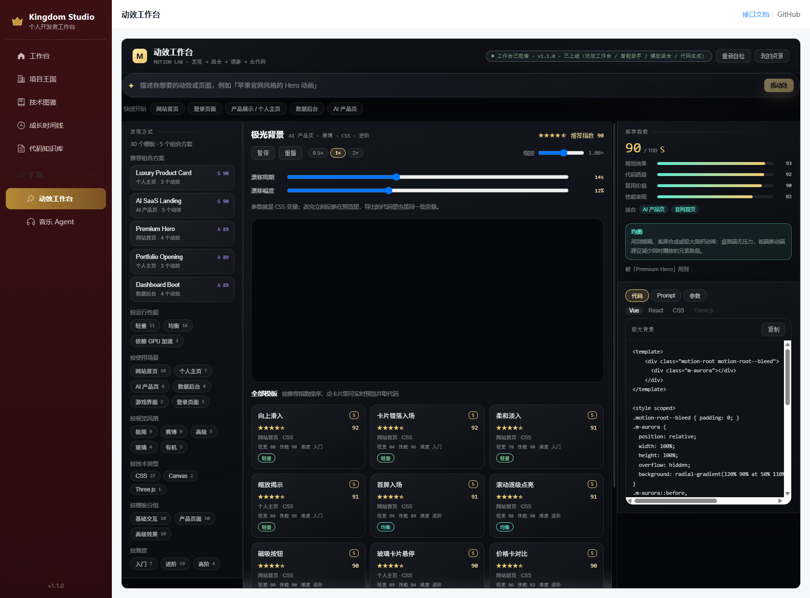
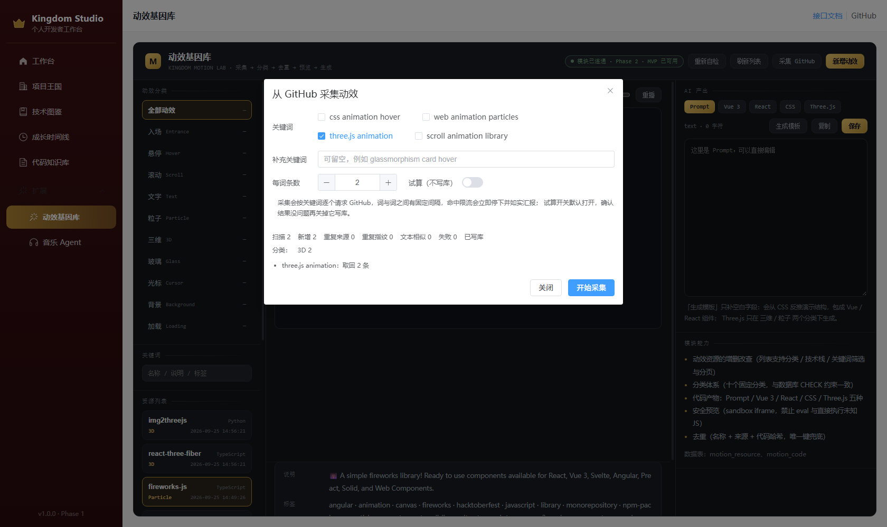
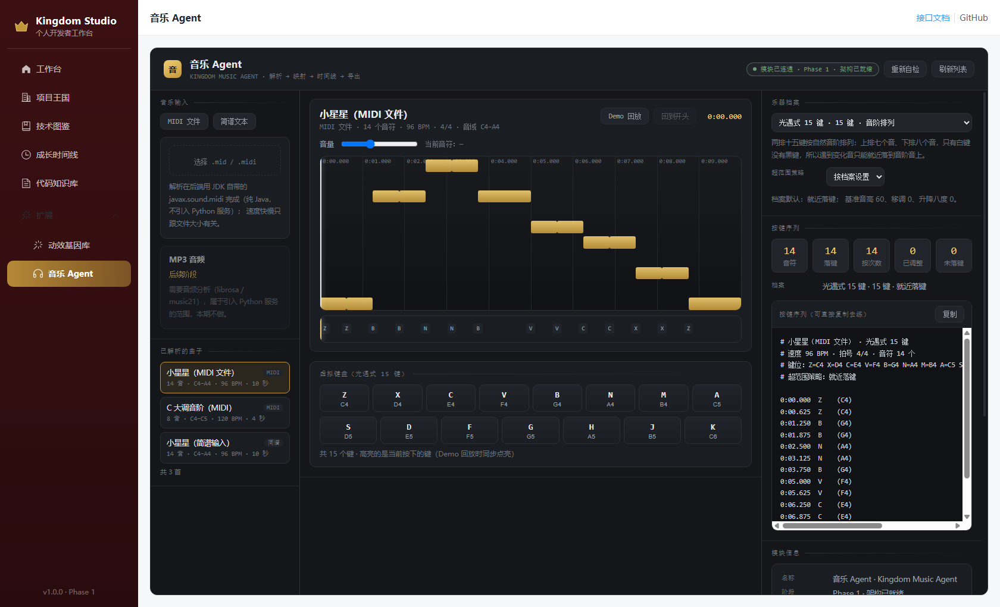
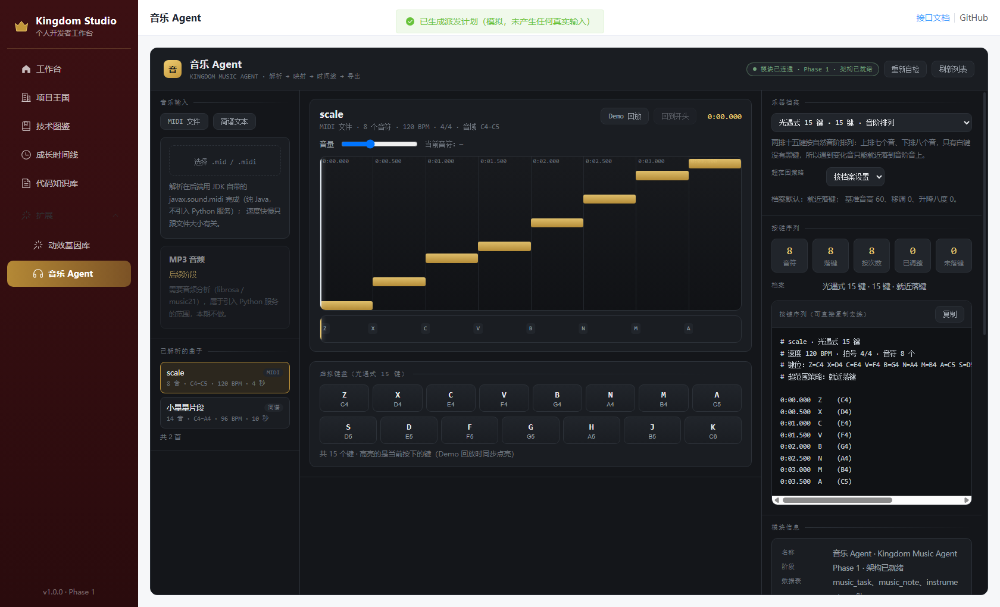

# Kingdom Extensions · 动效基因库 & 音乐 Agent

> 两个给个人开发者工作台做的扩展模块：一个负责**收集与再造网页动效**，一个负责**把曲子翻译成乐器按键**。
> 它们与主站（项目王国 / 技术图鉴 / 成长时间线 / 代码知识库）相互独立，各自有一套完整的数据库表、后端接口与前端页面。

| | 动效基因库 / Motion Lab | 音乐 Agent / Music Agent |
| --- | --- | --- |
| 一句话 | 官方 30 + 社区精选 30 的双集合动效库：发现、策展、按需求挑模板、组方案、调参、出码 | MIDI / 简谱解析 → 键位映射 → 时间线回放 → 演奏脚本导出 → 本机演奏（用户主动开启 + ESC 急停）→ AI 助手选方案 |
| 界面 | 两个三栏页面：资源管理（分类树 + 列表 / 沙箱预览 + 代码面板）与动效工作台（分面与组合 / 预览与参数 / 评分与运行档位） | 三栏工作台：输入与曲库 / 时间线与虚拟键盘 / 乐器档案与导出 |
| 技术要点 | Redis 缓存采集、三级去重、沙箱预览、模板化代码生成；模型优先且会如实回退的动效助手、三档运行成本标注 | `javax.sound.midi` 纯 Java 解析、音阶/半音两套键位展开、WebAudio 回放 |
| 数据表 | `motion_resource`、`motion_code`、`motion_template`、`motion_recipe`、`motion_rating`、`motion_candidate` | `music_task`、`music_note`、`instrument_profile` |
| 后端接口 | 25 个（资源 8 + 采集 2 + 工作台 10 + 候选池 5） | 25 个（含映射、乐器档案、宏导出、本机演奏与 AI 助手） |
| 单测 | 111 个 | 97 个 |

代码在本机工作台的仓库里，本仓库负责**讲清楚这两个模块是什么、怎么设计的、怎么验证的**：

- 后端模块：<https://github.com/Dongxibie/kingdom-studio/tree/master/backend/src/main/java/com/kingdomstudio/modules>
- 前端模块：<https://github.com/Dongxibie/kingdom-studio/tree/master/frontend/src/extensions>
- 建表与种子：<https://github.com/Dongxibie/kingdom-studio/tree/master/db>

---

## 截图

**动效基因库**：左侧分类与资源列表，中间沙箱实时预览（图中是正在播放的骨架屏微光），右侧五类代码产物与模块能力。



**动效工作台**：左栏六个分面（场景 / 风格 / 技术 / 分组 / 性能成本 / 难度）+ 组合方案，
中间实时预览与参数滑块，右侧推荐指数的四项子分与运行档位。截图里选中的是「极光背景」（均衡档）。



**按关键词采集 GitHub**：默认只试算不写库；统计里逐项区分「扫描 / 新增 / 重复来源 / 重复指纹 / 文本相似」，每个关键词的执行情况单独列在下方。



**音乐 Agent**：曲库、钢琴卷帘时间线、按键轨、虚拟键盘与按键序列导出。



**桌面代理（模拟派发）**：把按键序列翻译成「按下 / 松开」成对的命令流，被规则调整或拦下的地方逐条说明。



---

## 三条可以现场演示的链路

### 1 · 采集动效并生成代码

在动效基因库点「采集 GitHub」→ 选关键词 → 先试算：系统会按关键词打分类、按「仓库地址 → 内容指纹 → README 文本相似」三级去重，并告诉你每一项被跳过还是新增；关掉试算开关再执行才会写库。入库后在右侧「AI 产出」里可以生成 Prompt / Vue 3 / React / CSS / Three.js 五种产物并保存。

采集器有三条纪律，都写在代码里并有单测兜着：

1. **不疯狂请求**：关键词之间固定间隔；响应头 `X-RateLimit-Remaining: 0` 或 HTTP 403/429 时立刻停下并如实说明，不继续撞限流。
2. **重试只针对值得重试的**：5xx 与网络异常退避 1s / 2s 重试；403/429 与其它 4xx 直接失败，不做无意义重试。
3. **缓存**：同一关键词的原始响应在 Redis 缓存 30 分钟，重复点采集不会重复打接口。

### 2 · 一句话描述需求，让助手挑出一套方案

在动效工作台的搜索栏输入「做一个苹果官网风格的 Hero 动效，要高级感」：

- 没配模型时走**内置的可解释检索**：识别出场景 = 网站首页、风格 = 高级、关键词 = hero，逐条给出命中理由（"场景匹配 / 风格匹配 / 关键词命中"）；
- 配了模型则**模型优先**：它只做四件事——理解需求、判断风格、从现有 30 个模板里挑、组合成一套方案并给参数建议；它不生成代码，返回的模板 key 还会被回库核对，杜撰的直接丢弃；
- 两种情况界面都会标明这次结果来自谁（徽章显示「模型分析 · 模型名」或「内置检索」），模型不可用时的原因也写在结果里。

点「按这个组合预览」即可把方案里的模板按顺序打开，模型给的参数建议会直接落到右侧参数面板上。

### 3 · 上传 MIDI 或粘贴简谱，得到按键序列

上传 `demo/scale.mid`（C 大调音阶）或 `demo/twinkle.mid`（小星星），也可以直接粘贴简谱：

```
1=C 4/4 BPM=96
1 1 5 5 | 6 6 5 - | 4 4 3 3 | 2 2 1 -
```

解析后会得到音符时间线、按键轨与一份可直接复制去练的按键序列文本。同一首小星星走 MIDI 与走简谱两条入口，解析结果完全一致（14 个音、96 BPM、10000ms、音域 C4–A4）——两条解析链路互相印证。

### 4 · 切换乐器档案，看同一首曲子怎么变

内置三套档案，同一首 C 大调音阶在三套档案上的结果是设计好的：

| 档案 | 键数 | 结果 |
| --- | --- | --- |
| 光遇式 15 键（音阶排列） | 15 | 8 个音全部落键、无需任何调整 |
| 键盘式 12 键（半音排列） | 12 | 7 个落键 + 1 个未落键（C5 超出上限，策略为跳过） |
| 八音盒 8 键（移八度，C4–C5） | 8 | 8 个音全部落键，超范围的音自动挪八度 |

点「Demo 回放」时，时间线走针、音符高亮与虚拟键盘会同步——声音是网页内用 WebAudio 合成的，**不会驱动任何系统输入**。

---

## 设计上最值得说的三件事

**一、按键映射不是「音高减基准音高」**

只有白键的乐器上，C 后面直接是 D，没有 C#；而键盘式排列相邻键差半音。同一个音高在两套乐器上落在第几个键，答案完全不同。所以映射引擎按「半音排列 / 音阶排列 / 自定义」三种方式**先展开一张键位表**（第几个键发什么音），再拿音符去查，而不是用音高之差当按键下标。超出音域时也不是悄悄丢音符，而是按档案指定的策略处理（跳过 / 就近落键 / 移八度），每一种都会在导出文本里写明理由。

**二、预览是沙箱，不是「在页面里跑用户的代码」**

动效预览走 `sandbox="allow-scripts"` 的 iframe（**刻意不给 `allow-same-origin`**）：即使贴进来的 CSS/JS 有问题，它也拿不到宿主页面的 DOM、Cookie 与本地存储。整个前端仓库没有 `eval`、`new Function`、`v-html`。

**三、Desktop Agent 只到协议为止**

「让程序替你去按键」是所有功能里风险最高的一个。所以这一步只做到**协议 + 命令流**：把按键序列翻译成按下/松开成对、带相对时间的命令，并在发送前用写死在代码里的规则校验（同一个键没松开不能再次按下、单次按住不得短于 40ms 或长于 2000ms、协议只传单键、命令总数上限 4000 条），被调整或拦下的地方逐条说明。真实执行留到具备急停与前台窗口限定的前提下再谈。协议见 [docs/desktop-agent-protocol.md](docs/desktop-agent-protocol.md)。

---

## 本地运行

两个模块跑在本机工作台里（需要 MySQL 8.0.16+、Redis、JDK 21、Node 18+）。

下面这些命令都在**主仓库**里执行（本仓库只有文档与演示素材，不含源码）：

```bash
git clone https://github.com/Dongxibie/kingdom-studio && cd kingdom-studio

# 1. 建库建表（按顺序，扩展表依赖主库已存在）
mysql -uroot -proot < db/kingdom_studio.sql              # 主站五张表
mysql -uroot -proot kingdom_studio < db/extensions_motion.sql
mysql -uroot -proot kingdom_studio < db/extensions_motion_seed.sql
mysql -uroot -proot kingdom_studio < db/extensions_motion_template.sql        # 工作台三张表（可重复执行）
mysql -uroot -proot kingdom_studio < db/extensions_motion_template_seed.sql   # 30 个官方模板 + 评分
mysql -uroot -proot kingdom_studio < db/extensions_motion_community_seed.sql  # 30 个社区模板 + 候选池
mysql -uroot -proot kingdom_studio < db/extensions_motion_recipe_seed.sql     # 30 套组合方案（119 步）
mysql -uroot -proot kingdom_studio < db/extensions_motion_community.sql       # 候选池表 + 模板来源列（可重复执行）
mysql -uroot -proot kingdom_studio < db/extensions_motion_community_seed.sql  # 30 个社区精选 + 118 条候选
mysql -uroot -proot kingdom_studio < db/extensions_music.sql
mysql -uroot -proot kingdom_studio < db/extensions_music_macro.sql          # 演奏计划表（可重复执行）

# 2. 后端（context-path = /api，端口 8080）
cd backend && mvn spring-boot:run

# 3. 前端（端口 5173）
cd ../frontend && npm install && npm run dev
```

打开 <http://localhost:5173> → 左侧菜单「扩展」→ 动效基因库 / 音乐 Agent。
接口文档：<http://localhost:8080/api/swagger-ui.html>（扩展模块对应 10 / 11 / 12 开头的四组标签）。

可选的两个环境变量（都不影响功能可用性）：

- `GITHUB_TOKEN`：GitHub 采集的限额从每小时 10 次提升到 30 次；不设置也能用，只是容易触发限流（触发时会立刻停下并告诉你原因）。
- `MOTION_LLM_BASE_URL` / `MOTION_LLM_API_KEY` / `MOTION_LLM_MODEL`：三项齐了动效助手才启用模型，
  服务商需兼容 OpenAI `/chat/completions`；不配就走内置检索，界面上照实说明。

---

## 目录

```
kingdom-extensions/
├── docs/
│   ├── motion-lab.md              动效基因库：架构、采集、去重、代码生成、数据模型
│   ├── motion-workbench.md        动效工作台：模板与组合、推荐指数、智能推荐、AI 设计、组合模式、运行档位
│   ├── motion-collections.md      双集合与候选池：官方 / 社区、发现 → 分析 → 筛选 → 转 Pattern
│   ├── music-agent.md             音乐 Agent：解析、映射引擎、时间线、回放、数据模型
│   └── desktop-agent-protocol.md  桌面代理执行协议（WebSocket 消息与安全约束）
├── demo/
│   ├── scale.mid                  C 大调音阶（120 BPM，8 个音，C4–C5）
│   ├── twinkle.mid                小星星（96 BPM，14 个音，C4–A4）
│   └── README.md                  两份演示曲目怎么用、能看出什么
└── screenshots/                   五个界面的截图
```

## 许可

文档、演示曲目与截图以 MIT 许可发布，见 [LICENSE](LICENSE)。
界面与代码的著作权归 [Dongxibie](https://github.com/Dongxibie)。
